    
    
    
    

  
<b>🛠️ Tech Stack</b>

    

        
| **Category** | **Technologies** |
| - | - |
**Frontend** | 
**Frameworks** |  
**Core** |     
**DevOps** |  
**Testing** |   
**Misc** | )  
**Editors** |  )
      
 See **[➡️ Full Tech Stack](TECH-STACK.md)**, for a list of projects using each of the above technologies
  

    

  
<b>👨‍💻 Coding stats</b>

    

         
        
    

  
<b>🐙💻 GitHub stats</b>

    

  

    
<b>🤝 Supporting others</b>

    

        
        
        
    

    

## I'm contributing to awesome software

* [Gitea: A self-hosted Git service](https://github.com/go-gitea/gitea/pulls?q=is%3Apr+author%3Asaitho)
* [semantic-releases: Emotionless automated semantic releases](https://github.com/semantic-release/semantic-release/pulls?q=is%3Apr+author%3Asaitho)
* [Robo: Modern task runner for PHP](https://github.com/consolidation/Robo/pulls?q=is%3Apr+author%3Asaitho)
* [GitHub Readme Stats](https://github.com/anuraghazra/github-readme-stats/pulls?q=is%3Apr+author%3Asaitho)
<!-- START OF PROFILE STACK, DO NOT REMOVE -->
| 💻 **Technology** | 🚀 **Projects** |
| - | - |
|  |  |
|  |  |
|  |  |
|  |      |
<!-- END OF PROFILE STACK, DO NOT REMOVE -->
